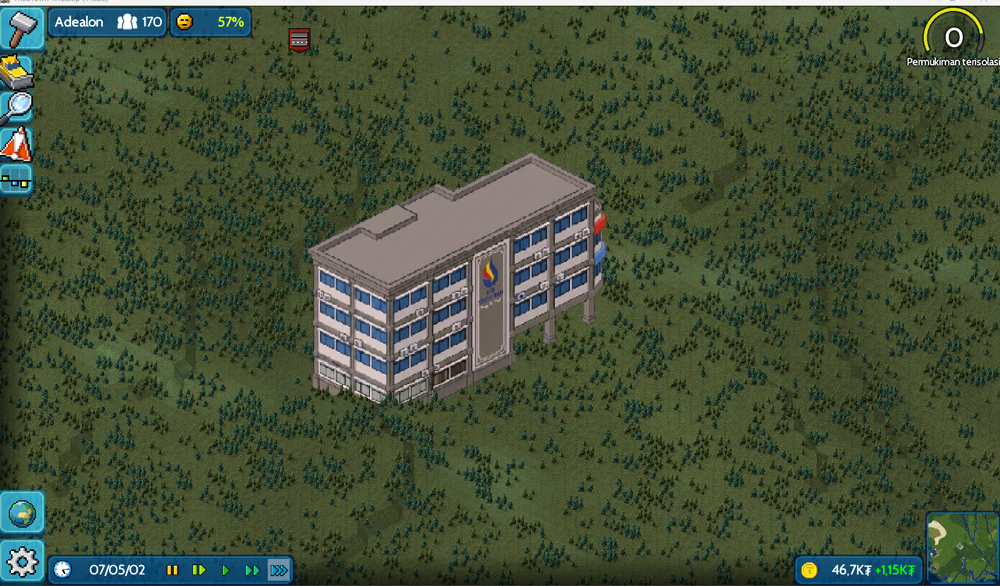

# ITB STIKOM Bali Building Plugin for TheoTown

## Deskripsi (Bahasa Indonesia)

Plugin ini menambahkan gedung **ITB STIKOM Bali** ke dalam game TheoTown. Dibuat dengan gaya pixel art yang menyesuaikan perspektif isometrik game untuk memberikan nuansa Indonesia pada kota buatanmu.

Gedung ini berfungsi sebagai Dekorasi di dalam game.

## Description (English)

This plugin adds the **ITB STIKOM Bali** building to TheoTown. It's created in a pixel art style that adapts to the game's isometric perspective to give your city an Indonesian feel.

This building functions as a Decoration in the game.

## Fitur / Features

- **Custom Pixel Art:** Desain original berdasarkan gedung asli ITB STIKOM Bali.
- **Indonesian Vibe:** Cocok untuk membangun kota bertema Indonesia.

## Screenshots

Berikut adalah tampilan gedung di dalam game:

_Tampilan gedung saat siang hari_

## Cara Install / Installation

1. Download file plugin (format .zip atau folder).
2. Pindahkan folder tersebut ke direktori plugin TheoTown kamu:
   - **Android:** `Android/data/info.flowersoft.theotown.theotown/files/plugins/`
   - **PC:** `C:/Users/[Username]/TheoTown/plugins/`
3. Buka game TheoTown plugin sudah terpasang!

## Credits

- **Author:** [ANTARTICA1]

---

_Disclaimer: This is a fan made plugin and is not officially affiliated with TheoTown or ITB STIKOM Bali._
